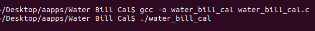
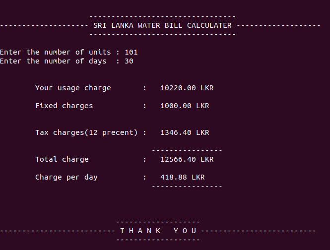

# Water-Bill-Generater-with-C
Calculate your domestic Water Bill easily

This document shows how to compile and run this C program on Ubuntu Linux using the **gcc compiler**. Please follow these simple steps.

## Run on Ubuntu OS

1. Open your clone folder. 
2. Right click & select **Open Terminal**. 
3. Now your terminal path is set to your app location.
4. Type this command to compile app.c. 
```
gcc -o app app.c
```
5. After that press enter key and type below command to run your C programme.
```
./app
```



## App Summery

Maianly I focused on this programme to get two inputs from the user.
1. Number of Units 
2. Number of Days

- First user can input the **Number of Units.** 
- Then after that user can input the **Number of Days.**
- Final display on the terminal : User usage charge, Fixed charge, Total charge & charge per day.


